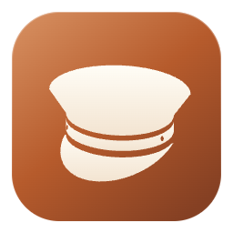
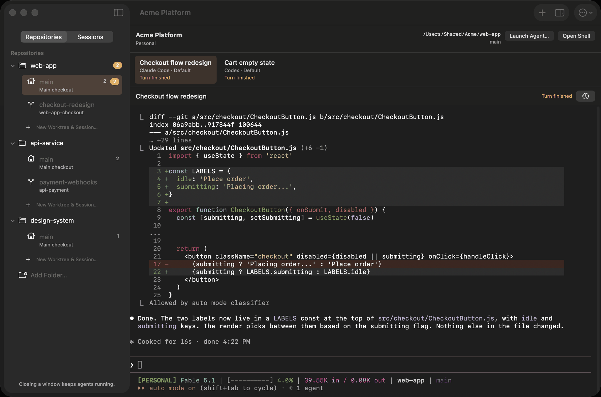

<p align="center">
  
</p>

<h1 align="center">Chauffeur</h1>

<p align="center">
  Run Codex and Claude Code in a native macOS app.<br>
  Keep projects, CLI profiles, and worktrees organized while your agents work.
</p>

<p align="center">
  
</p>

Chauffeur is for working across several repositories or clients with Codex and
Claude Code. Each project gets its own window, and each agent launches with the
CLI profile you choose. The CLIs run in embedded terminals with their usual
prompts, tools, and approvals.

- **Separate profiles for each client.** Save agent presets with their own
  `CODEX_HOME` or `CLAUDE_CONFIG_DIR`, then organize them into teams.
- **A window for each project.** Keep related repositories and sessions together,
  or put projects on separate macOS Spaces.
- **Worktrees from the sidebar.** Create a worktree and start an agent in one step.
  Run multiple sessions on a checkout, open a shell, and remove worktrees when
  you're done.
- **Sessions keep running after you quit.** A background service keeps agents
  running when you close a window or quit Chauffeur. Reopen the app to reconnect.
- **Session status and notifications.** See when an agent finishes a turn or needs
  input, where supported by the CLI. Open active projects from the menu bar.
- **Agent communication and orchestration.** Codex and Claude exchange messages
  through MCP. Run a plan through fresh worker sessions with the orchestrator
  skill, choosing a model for each task and retaining every attempt’s history.
- **Searchable terminal history.** Press ⌘F to search saved output, including
  sessions that have ended.

## Build and run

You'll need:

- macOS 15 or newer on Apple Silicon
- Git and tmux available in your login shell
- Codex and/or Claude Code installed (the setup wizard can help you sign in)
- Xcode 26.3 (Swift 6.2) and XcodeGen

To build from source, copy the local signing configuration and set
`DEVELOPMENT_TEAM` in it:

```sh
cp Configuration/LocalSigning.xcconfig.example Configuration/LocalSigning.xcconfig
```

Then build and open the app:

```sh
make build
open 'build/Build/Products/Debug/Chauffeur Debug.app'
```

For an optimized build, run `make release` and open
`build/Build/Products/Release/Chauffeur.app`, or run `make install` to build it,
replace `/Applications/Chauffeur.app`, and relaunch. Debug and Release can run side
by side with separate settings and sessions.

See [building and verifying](docs/building.md) for signing options and tests.
For signed, notarized GitHub releases, see [release setup](docs/notarization.md).
If macOS asks you to allow the background service, follow the link to Login Items
& Extensions in the app. See [service recovery](docs/service-recovery.md) if it
won't start.

## Set up your first project

1. Choose **Set Up Teams…** on Welcome, or **Settings → Teams → Add Team…**.
   Choose your agents, say whether each uses one or several accounts, and name
   teams such as *Personal*, *Work*, or a client. Use existing configurations or
   create `~/.codex-<team>` / `~/.claude-<team>` folders with selected settings
   copied from an editable source. Source folders stay unchanged and login
   credentials are excluded. The wizard opens each new profile's sign-in and
   checks its CLI authentication status.
2. Create a project and choose its team. Select a parent folder to discover
   repositories, or add repository folders individually.
3. Open the project and start a session. Choose a group, an agent preset, and an
   existing checkout or a new worktree. Add any other repositories the agent
   needs access to.

Teams can share a configuration—for example, separate Claude accounts with one
shared Codex account. Shared folders also share login and settings changes.
**Save and Finish Later** preserves unfinished setup; **Resume Setup…** returns
to it. Sign-in verification reports what the CLI can establish, with identity
shown when available; it does not test model access or quota. Missing executables,
unrecognized status output, and unavailable directories remain visible for retry.

Select a checkout in the sidebar to switch between its sessions or start another
one. **Session Details** shows launch information and controls for stopping a
session or resuming its conversation.

Closing a window or quitting the app leaves sessions running. To end one, use
**Stop Session**. **Resume Conversation** starts a new execution using the saved
conversation ID and original preset.

## Agent coordination

Chauffeur includes an experimental MCP server for messages and delegation between
sessions in a project group. The orchestrator skill runs a plan through fresh
worker sessions, reviews MCP completion reports, and can submit corrections or
replace a worker while retaining its history. Workers support per-session model
and reasoning overrides. See [orchestration validation](docs/orchestration-validation.md)
for tested provider versions and reproducible checks.

The [coordination skills](docs/coordination-skill.md) are linked automatically
into Codex’s shared skills directory and every team’s Claude directory. They
update with Chauffeur and also apply to sessions started outside it. View their
status in **Settings → Agent Presets → Chauffeur Skill…**.

To try it, launch sessions in the same project/group with **Enable Chauffeur
messaging and delegation** turned on. Ask an agent to “use the chauffeur skill
to discover peers and check my inbox,” or ask a coordinator to “use
chauffeur-orchestrator to execute `docs/plans/my-plan.md`, one worker at a time.”
Messages do not wake idle agents; prompt the recipient to check its inbox.
Delegated workers use native YOLO permissions. The
[manual walkthrough](docs/manual.html#coordination) covers messaging, completion
reports, corrections, replacements, and recovery.

Coordination and status reporting depend on the CLI version. Unsupported versions
require an explicit basic-terminal launch, with coordination and status features
unavailable. See [compatibility](docs/compatibility.md) for tested versions and
known limits. Full release workload testing is also pending.

## Documentation

The [app manual](docs/manual.html) covers the screens, workflows, and keyboard
shortcuts. Open it locally in a browser. A native iPhone remote-control app is
in proof-of-concept; see [mobile remote control](docs/mobile-remote.md).
