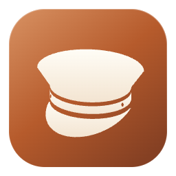
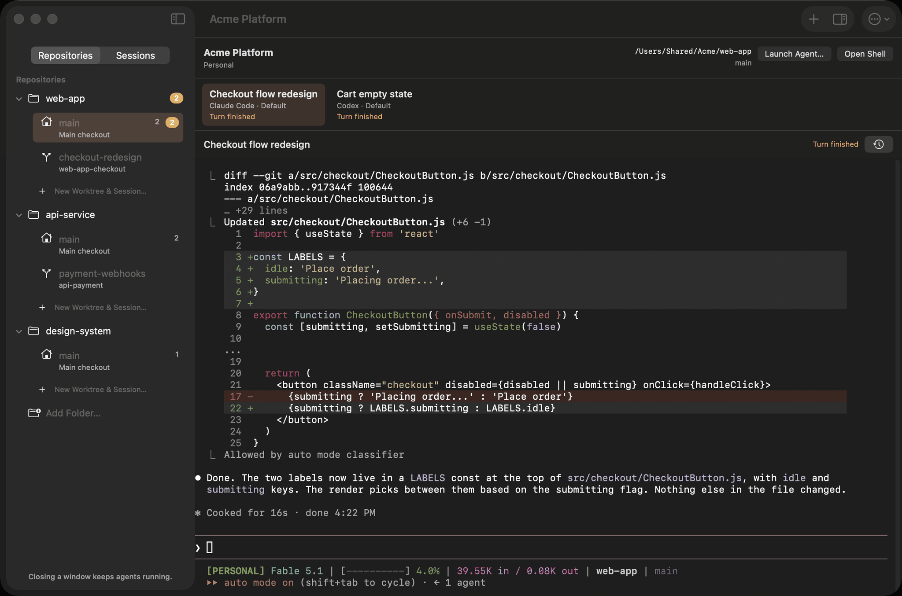

<p align="center">
  
</p>

<h1 align="center">Chauffeur</h1>

<p align="center">
  Run Codex and Claude Code in a native macOS app.<br>
  Keep projects, CLI profiles, and worktrees organized while your agents work.
</p>

<p align="center">
  
</p>

Chauffeur is for working across several repositories or clients with Codex and
Claude Code. Each project gets its own window, and each agent launches with the
CLI profile you choose. The CLIs run in embedded terminals with their usual
prompts, tools, and approvals.

- **Separate profiles for each client.** Save agent presets with their own
  `CODEX_HOME` or `CLAUDE_CONFIG_DIR`, then organize them into teams.
- **A window for each project.** Keep related repositories and sessions together,
  or put projects on separate macOS Spaces.
- **Worktrees from the sidebar.** Create a worktree and start an agent in one step.
  Run multiple sessions on a checkout, open a shell, and remove worktrees when
  you're done.
- **Sessions keep running after you quit.** A background service keeps agents
  running when you close a window or quit Chauffeur. Reopen the app to reconnect.
- **Session status and notifications.** See when an agent finishes a turn or needs
  input, where supported by the CLI. Open active projects from the menu bar.
- **Agent communication and orchestration.** Codex and Claude exchange messages
  through MCP. Run a plan through fresh worker sessions with the orchestrator
  skill, choosing a model for each task and retaining every attempt’s history.
- **Searchable terminal history.** Press ⌘F to search saved output, including
  sessions that have ended.
- **Progress on iPhone.** See registered worker progress in the session list,
  then open **… → Progress** from a terminal to view the full HTML panel.

## Build and run

You'll need:

- macOS 15 or newer on Apple Silicon
- Git and tmux available in your login shell
- Codex and/or Claude Code installed (the setup wizard can help you sign in)
- Full Xcode 26.3 (Swift 6.2), not just Command Line Tools, and XcodeGen
- For certificate signing, a certificate **with its private key** in this macOS
  user's keychain; ad-hoc local builds do not require one

Install Xcode, open it once to finish setup, and select it in **Xcode → Settings
→ Locations → Command Line Tools**. Install XcodeGen and tmux if needed (with
Homebrew: `brew install xcodegen tmux`). From the repository directory, check
the selected tools and available signing identities:

```sh
xcode-select -p
xcodebuild -version
security find-identity -v -p codesigning
```

For a local install without an Apple account or signing certificate, run:

```sh
make install XCODEBUILD_ARGS='DEVELOPMENT_TEAM= CODE_SIGN_STYLE=Manual CODE_SIGN_IDENTITY=-'
```

To keep using ad-hoc signing with plain `make install`, create
`Configuration/LocalSigning.xcconfig` with:

```xcconfig
DEVELOPMENT_TEAM =
CODE_SIGN_STYLE = Manual
CODE_SIGN_IDENTITY = -
```

Ad-hoc builds are for local use. Their helper signatures change when rebuilt,
which can require refreshing background-service registration; certificate
signing provides a stable identity across updates.

For certificate signing, if the identity check reports **0 valid identities**,
set up signing before building. Add your Apple account in **Xcode → Settings
→ Accounts**, select your team, and use **Manage Certificates…** to create an
Apple Development certificate.

When migrating to a new macOS user, certificates and private keys in the old
user's login keychain are not available automatically. In the old account, open
**Keychain Access → login → My Certificates**, select the identities you want
to transfer, and export them as a password-protected `.p12`. Import that file
into the new user's **login** keychain and enter the export password. Exporting
only a `.cer` file does not transfer the private key. Run the identity check
again, then delete the temporary export after a successful import. Enter
passwords in local prompts, not in shell commands.

Copy the local signing configuration and edit it with your team ID (shown in
Xcode's account settings or the signing identity's name):

```sh
cp Configuration/LocalSigning.xcconfig.example Configuration/LocalSigning.xcconfig
```

Set `DEVELOPMENT_TEAM` to your actual team ID, replacing `YOUR_TEAM_ID`. The
default is Apple Development signing. If you migrated a Developer ID Application
identity, also uncomment and fill in `CODE_SIGN_STYLE = Manual` and
`CODE_SIGN_IDENTITY = Developer ID Application: Your Name (YOUR_TEAM_ID)` in that
file. Use the same certificate for subsequent builds so the background service
keeps a stable signing identity. This configuration is gitignored and must be
created separately for each checkout; copying certificates does not create it.

Build and install the optimized app:

```sh
make install
```

This replaces `/Applications/Chauffeur.app`, launches it, and waits for its
background runtime to become ready. If macOS requests background-service
approval, allow Chauffeur in **System Settings → General → Login Items &
Extensions** while installation waits. If verification times out, enable the
service and rerun `make install`. To install in your own Applications folder,
use `make install INSTALL_DIR="$HOME/Applications"`.

For a development build:

```sh
make build
open 'build/Build/Products/Debug/Chauffeur Debug.app'
```

To build Release without installing, run `make release` and open
`build/Build/Products/Release/Chauffeur.app`. Debug and Release can run side by
side with separate settings and sessions. If Xcode reports that signing requires
a development team, check `Configuration/LocalSigning.xcconfig`; if it cannot
find the certificate, check the current user's identities with the command above.

See [building and verifying](docs/building.md) for signing options and tests.
For signed, notarized GitHub releases, see [release setup](docs/notarization.md).
If macOS asks you to allow the background service, follow the link to Login Items
& Extensions in the app. See [service recovery](docs/service-recovery.md) if it
won't start.

## Set up your first project

1. Choose **Set Up Teams…** on Welcome, or **Settings → Teams → Add Team…**.
   Choose your agents, say whether each uses one or several accounts, and name
   teams such as *Personal*, *Work*, or a client. Use existing configurations or
   create `~/.codex-<team>` / `~/.claude-<team>` folders with selected settings
   copied from an editable source. Source folders stay unchanged and login
   credentials are excluded. Previewing the copy is optional; creation uses the
   current selections and source files. The wizard opens each new profile's sign-in and
   checks its CLI authentication status.
2. Create a project and choose its team. Select a parent folder to discover
   repositories, or add repository folders individually.
3. Open the project and start a session. Choose a group, an agent preset, and an
   existing checkout or a new worktree. Add any other repositories the agent
   needs access to.

Teams can share a configuration—for example, separate Claude accounts with one
shared Codex account. Shared folders also share login and settings changes.
**Save and Finish Later** preserves unfinished setup; **Resume Setup…** returns
to it. Sign-in verification reports what the CLI can establish, with identity
shown when available; it does not test model access or quota. Missing executables,
unrecognized status output, and unavailable directories remain visible for retry.

Select a checkout in the sidebar to switch between its sessions or start another
one. **Session Details** shows launch information and controls for stopping a
session or resuming its conversation.

Closing a window or quitting the app leaves sessions running. To end one, use
**Stop Session**. **Resume Conversation** starts a new execution using the saved
conversation ID and original preset.

## Agent coordination

Chauffeur includes an experimental MCP server for messages and delegation between
sessions in a project group. The orchestrator skill runs a plan through fresh
worker sessions, reviews MCP completion reports, and can submit corrections or
replace a worker while retaining its history. Workers support per-session model
and reasoning overrides. See [orchestration validation](docs/orchestration-validation.md)
for tested provider versions and reproducible checks.

The [coordination skills](docs/coordination-skill.md) are linked automatically
into Codex’s shared skills directory and every team’s Claude directory. They
update with Chauffeur and also apply to sessions started outside it. View their
status in **Settings → Agent Presets → Chauffeur Skill…**. The bundled
`implementation-progress` skill also registers its panel automatically in the
session’s **Progress** tab, even with messaging and delegation disabled. See
[progress panels](docs/implementation-progress.md).

To try it, launch sessions in the same project/group with **Enable Chauffeur
messaging and delegation** turned on. Ask an agent to “use the chauffeur skill
to discover peers and check my inbox,” or ask a coordinator to “use
chauffeur-orchestrator to execute `docs/plans/my-plan.md`, one worker at a time.”
Messages do not wake idle agents; prompt the recipient to check its inbox.
Delegated workers use native YOLO permissions. The
[manual walkthrough](docs/manual.html#coordination) covers messaging, completion
reports, corrections, replacements, and recovery.

Daily Codex and Claude Code updates are accepted without a version allowlist.
Chauffeur checks provider identity, available CLI options, and live terminal
readiness; an unrecognized executable can still run in basic terminal mode. See [compatibility](docs/compatibility.md) for tested versions and
known limits. Full release workload testing is also pending.

## Documentation

The [app manual](docs/manual.html) covers the screens, workflows, and keyboard
shortcuts. Open it locally in a browser. A native iPhone remote-control app is
in proof-of-concept; see [mobile remote control](docs/mobile-remote.md).
