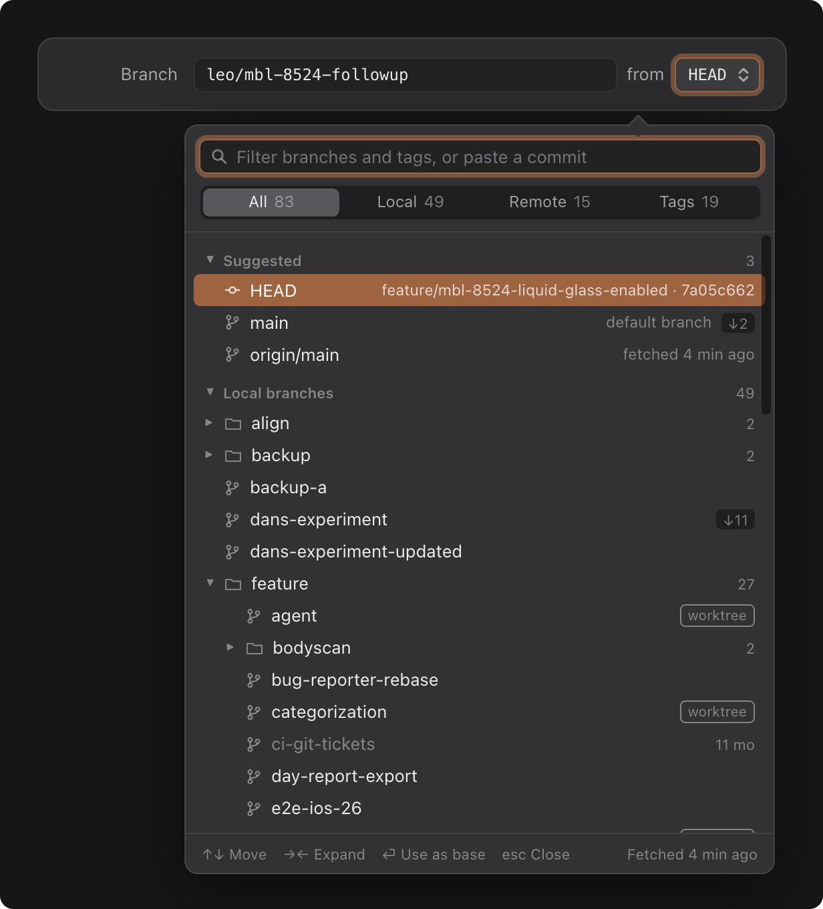
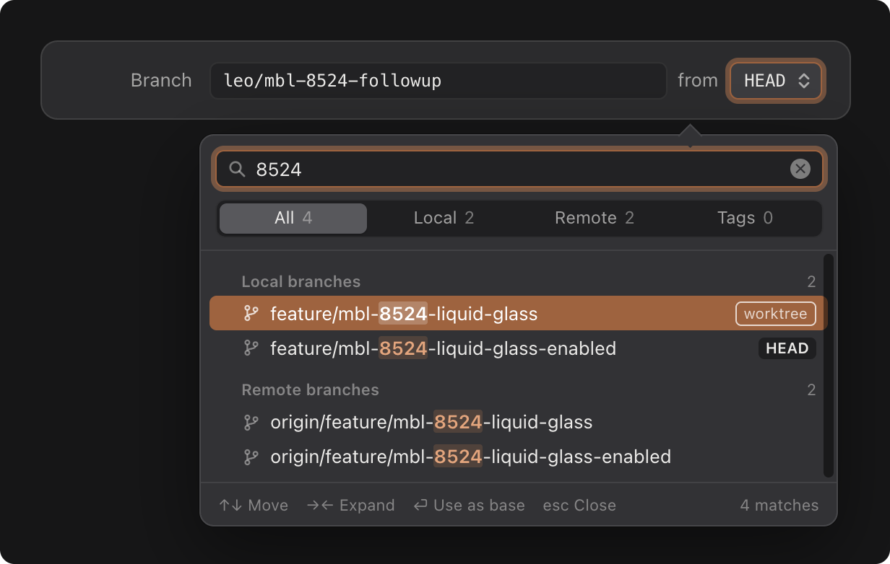
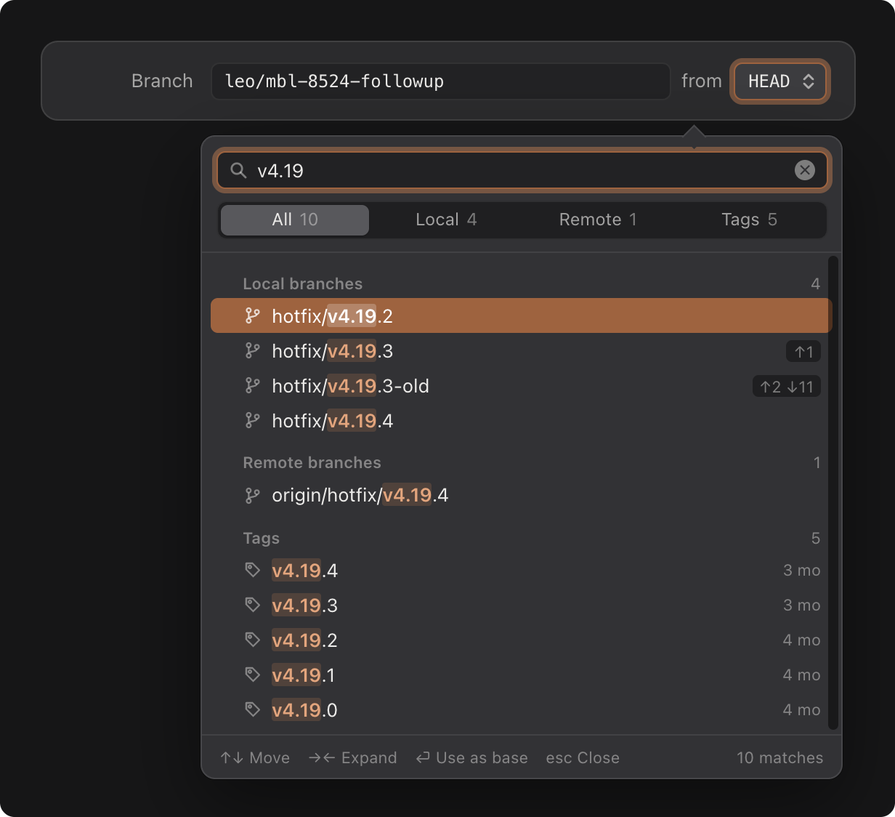
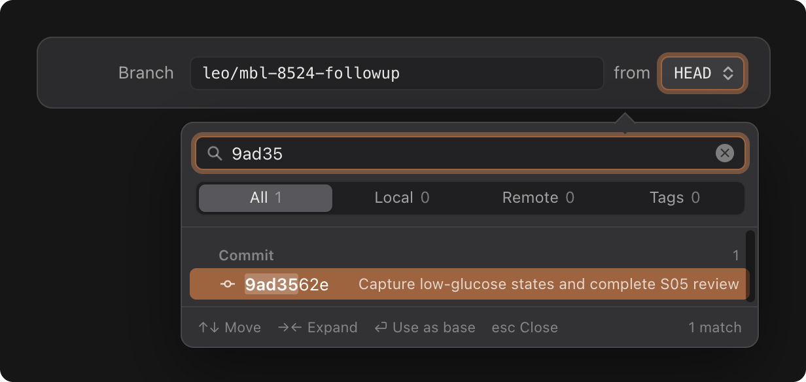
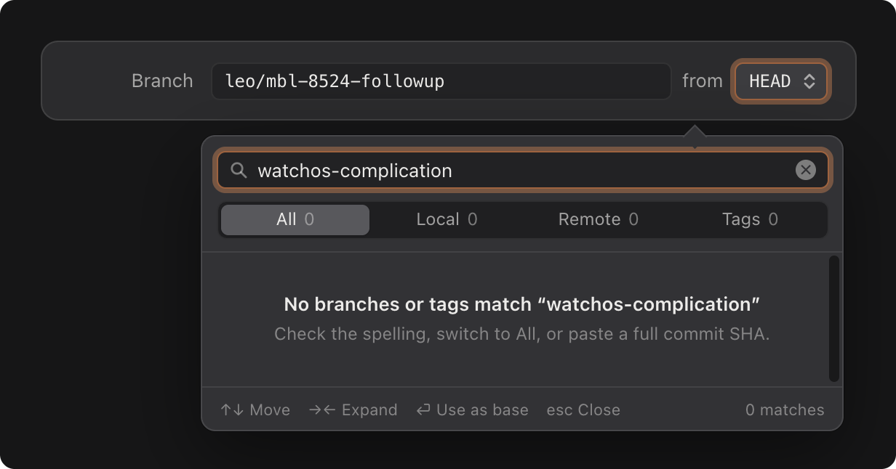

# Chauffeur · Base Ref Picker — Handoff

Searchable popover for choosing the **base ref** when creating a new worktree in the New Agent Session sheet. It replaces the plain Base field or pop-up. The default stays `HEAD`.

Live mockup: `Agent Launch Sheet.dc.html`, section 3 (3a–3f).

> **Behavior change (B7):** the base ref becomes a searchable popover that lists local branches, remote branches and tags, and also accepts commit SHAs. Everything else in the sheet is unchanged.

---

## Screenshots

| | |
|---|---|
| **01 Browse** — the default open state |  |
| **02 Filter “8524”** — flattened list with full paths |  |
| **03 Filter “v4.19”** — branches and tags together |  |
| **04 Pasted SHA** — resolves to a commit |  |
| **05 No match** |  |

All screenshots use the dark appearance. Light appearance uses the same structure with system semantic colors.

---

## Anchor & container

- The trigger is the `from` button to the right of the Branch field (New worktree mode only). The button shows the picked ref in 12pt monospaced text, middle-truncated, max width 230pt, followed by an up/down chevron.
- `.popover(isPresented:, arrowEdge: .top)`, attached to the button.
- Width **440pt**. The list's max height is **360pt**, rising to 440pt when the screen has at least 800pt of vertical space. Rows are virtualised (`List` / `LazyVStack`).
- Structure (top to bottom):
  1. **Filter field**: 26pt tall, 10pt inset, magnifier icon, and a clear button when not empty. Focused on open. Placeholder: *Filter branches and tags, or paste a commit*.
  2. **Scope control**: full-width segmented `All · Local · Remote · Tags`, each label followed by a count in tertiary text. The counts reflect the current filter.
  3. Hairline divider.
  4. **List**.
  5. Hairline divider, then a **footer**: 11pt tertiary key hints on the left (`↑↓ Move`, `→← Expand`, `⏎ Use as base`, `esc Close`) and a status on the right (`Fetched 4 min ago`, or `N matches` while filtering).

## Rows

| Element | Spec |
|---|---|
| Height | 24pt; 6pt horizontal inset; 5pt corner radius on the highlight |
| Indent | 8pt + 16pt per tree depth |
| Disclosure | 8pt triangle; the space is reserved on leaf rows so icons align |
| Icon | 12pt: branch, tag, commit (HEAD / SHA), folder. Secondary color |
| Name | 13pt system, single line, tail-truncated. **Dimmed** (tertiary) when merged or stale |
| Trailing metadata | Only when present, in this order: subtitle · `Merged` · age · `worktree` · `HEAD` · ahead/behind · folder count |
| Highlight | Accent fill; all text and icons turn white (secondary at 75%) |

Trailing metadata definitions:
- **subtitle**: Suggested rows only, e.g. `feature/mbl-8524-liquid-glass-enabled · 7a05c662`, `default branch`, `fetched 4 min ago`. For a SHA match, the commit subject.
- **worktree**: an outlined tag meaning the branch is checked out in some worktree. Informational only; it's still valid as a base. Tooltip: *Checked out in a worktree*.
- **HEAD**: filled tag on the currently checked-out branch.
- **ahead/behind**: e.g. `↑10 ↓32`, relative to the branch's upstream. Omitted when both are 0 or there is no upstream.
- **age**: shown on every tag; shown on branches only if the last commit is older than 6 months (such branches are also dimmed).
- **folder count**: number of descendant refs.

## Browse mode (empty filter) — screenshot 01

Sections have a collapsible header: 11pt semibold tertiary, with the count right-aligned.

1. **Suggested** (only in `All`): `HEAD` (with branch name and short SHA), the default branch, and that branch's upstream (`origin/main`).
2. **Local branches**: shown as a tree.
3. **Remote branches**: a tree whose first level is the remote (`origin/`, `upstream/`).
4. **Tags**: flat, newest creator date first. The first 6 show, then a `Show N more tags` link row. Choosing the `Tags` scope shows all of them.

Tree rules:
- Split ref names on `/`. Every segment except the last becomes a folder, and folders can nest (`feature/bodyscan/…`).
- Folders and leaves are sorted together, alphabetically and case-insensitively, as in the sidebar screenshots.
- Default expansion: all sections, plus `local:feature` and `remote:origin`. Expansion state is **persisted per repository**.

## Filter mode — screenshots 02–04

- Case-insensitive **substring** match on the full ref path, e.g. `feature/mbl-8524-liquid-glass`. (Optional later: segment-aware fuzzy matching.)
- Results are **flattened**, with no tree. Each row shows `dir/` in tertiary text followed by the name. The matched range gets bold weight and an accent tint (a white tint on the highlighted row).
- Results are grouped under non-collapsible headers `Local branches`, `Remote branches`, `Tags`, each with a result count. Empty groups are hidden.
- Order inside a group: exact name match, then prefix match, then substring match; ties are broken by most recent commit.
- **Commit lookup**: if the query is 4–40 hex characters, run `git rev-parse --verify <q>^{commit}`, debounced by 150ms. On success, show a `Commit` group at the top with the short SHA and its subject. The `All` count includes it.
- The first result is highlighted automatically, so ⏎ immediately picks the best match.

## Empty state — screenshot 05

Centered in the list:
- Title: `No branches or tags match “<query>”`, or `No commit starting with “<query>”` for a hex query.
- Body (tertiary): *Check the spelling, switch to All, or paste a full commit SHA.*

## Keyboard

| Key | Action |
|---|---|
| typing | Filters. Focus stays in the field the whole time |
| ↑ / ↓ | Move the highlight through rows, including folders |
| → / ← | Expand or collapse the highlighted folder (browse mode; only while the field is empty) |
| ⏎ | Pick the highlighted ref and close. On a folder, toggle it |
| esc | Close the popover without changing the value. It does **not** cancel the sheet; a second esc does |
| ⌘⌫ | Clear the filter |

Moving the mouse over a row highlights it, as in native menus. Clicking a ref picks it and clicks on a folder or section header toggle it.

## After picking

- The button label updates, and the sheet's destination preview re-resolves (see the sheet spec: loading → path, or error + Retry).
- **Remote branch**: it's used as the start point (`git worktree add -b <branch> <path> origin/x`). No local tracking branch is created.
- **Tag or SHA**: it's used as the start point as-is.
- A non-default base is shown in the Options summary tokens only if we later decide to surface it there. It isn't today.

## States

| State | Treatment |
|---|---|
| Loading refs (first open, large repos) | Show the filter field and scope control, with 6 skeleton rows in the list. The footer reads `Loading refs…` |
| Ref list stale (last fetch over 1h) | Footer: `Fetched 2 h ago`. No auto-fetch |
| Git error | Replace the list with the message and a `Retry` button. The popover stays open |
| Repository has no tags / remotes | Hide that section and disable its scope segment |

## Accessibility

- The list is an `outline` (`OutlineGroup`); each row's label is `name, kind, metadata`, e.g. *“mbl-8470-workout-filter-chips, local branch, 10 ahead, 32 behind”*.
- VoiceOver announces the number of results after each filter change.
- Dimming never removes information: stale and merged rows keep their `Merged` or age label.
- Respect Increase Contrast; the highlight uses the system accent.

## SwiftUI sketch

```swift
struct RefPicker: View {
    @Binding var selection: GitRef          // default .head
    @State private var query = ""
    @State private var scope: RefScope = .all   // .all .local .remote .tags
    @AppStorage("refPicker.expanded.\(repoID)") private var expandedRaw = "local:feature,remote:origin"
    @FocusState private var filterFocused: Bool
    @State private var highlight: GitRef.ID?

    var body: some View {
        VStack(spacing: 0) {
            VStack(spacing: 8) {
                SearchField("Filter branches and tags, or paste a commit", text: $query)
                    .focused($filterFocused)
                    .onKeyPress(.downArrow) { move(+1) }
                    .onKeyPress(.upArrow)   { move(-1) }
                    .onKeyPress(.return)    { commit() }
                Picker("", selection: $scope) { /* All 83 · Local 49 · Remote 15 · Tags 19 */ }
                    .pickerStyle(.segmented).labelsHidden()
            }
            .padding(10)
            Divider()
            ScrollViewReader { proxy in
                List(selection: $highlight) {
                    if query.isEmpty { browseSections } else { filteredSections }
                }
                .listStyle(.plain)
                .frame(maxHeight: 360)
            }
            Divider()
            footer
        }
        .frame(width: 440)
        .onAppear { filterFocused = true }
    }
}
```

`GitRef` needs: `kind` (`.head / .local / .remote / .tag / .commit`), `fullName`, `shortSHA`, `upstreamAheadBehind`, `isMerged` (into default branch), `lastCommitDate`, `isCheckedOutInWorktree`, `isHEAD`.

## Acceptance checklist

- [ ] Opens with the filter focused and the current base highlighted.
- [ ] 80+ refs scroll smoothly; the tree shows nested `/` folders with counts.
- [ ] Typing `8524` shows local and remote matches with full paths and tinted matches, and the first result is highlighted.
- [ ] Typing `v4.19` shows hotfix branches and tags together, and the scope counts update.
- [ ] Pasting a short SHA lists the commit first, with its subject.
- [ ] ↑↓ ⏎ → ← and esc behave as specified; esc does not close the sheet.
- [ ] Picking a ref updates the button and re-resolves the destination preview.
- [ ] Folder expansion is remembered per repository.
