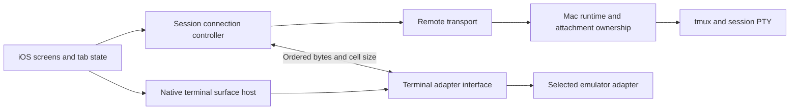

# Native iOS remote control — implementation plan

- Date: 2026-09-17
- Status: Planned; implementation has not started.
- Scope: [PRD](mobile-poc-prd.md) and [approved low-fi screen flow](mobile-poc-flow.html).
- Architecture constraint: The terminal emulator must be replaceable. SwiftTerm is the current desktop engine; Ghostty is under consideration, not a selected or validated iOS dependency.

## 1. Delivery approach

Build a working path from an iPhone to a Mac-hosted terminal first. Add browsing, launching, and tabs after the transport and terminal contract work. Keep each increment reviewable and preserve desktop behavior throughout.

The Mac background runtime owns remote access. After setup/pairing, browsing, worktree creation, launching, and terminal interaction must work with the desktop app quit. The Mac must be awake and reachable on the same LAN.

Do not implement final visual design, internet connectivity, project/preset editing, or the other deferred PRD features. A replacement desktop emulator is a separate change; this work establishes the boundary needed to support it.

## 2. Current foundations and required seams

| Existing area | Current behavior | Planned change |
| --- | --- | --- |
| `Sources/ChauffeurRuntime/RuntimeMain.swift` | Background runtime entry point. | Start/stop an opt-in remote listener with the runtime, independent of UI lifetime. |
| `Sources/ChauffeurRuntimeKit/IPCServer.swift` | Same-user Unix socket IPC; dispatch and terminal streaming. | Retain local IPC. Add a separate authenticated remote API with an explicit operation allowlist. |
| `Sources/ChauffeurRuntimeKit/RuntimeCoordinator.swift` | Authoritative inventory, launch, worktree, and validation behavior. | Share domain operations with remote handlers; add operation reconciliation where existing retry behavior is insufficient. |
| `Sources/ChauffeurRuntimeKit/TmuxHost.swift` | tmux process ownership; single attachment; output writes directly to `SocketConnection`. | Introduce a transport-independent attachment output sink and explicit control ownership transfer. |
| `Sources/ChauffeurApp/TerminalPane.swift` | Controller combines SwiftTerm view, local IPC, keyboard callbacks, and connection state. | Separate session connection/control from emulator integration; preserve existing history and desktop controls. |
| `Sources/ChauffeurCore` | Models mixed with host filesystem, socket, and C dependencies. | Extract only portable wire records/contracts required by both platforms. Do not bring host process APIs into iOS. |
| `Package.swift`, `project.yml` | macOS package/app configuration and pinned SwiftTerm dependency. | Add iOS target/scheme and portable modules; scope platform-specific settings and engine dependencies to their targets. |

Proposed modules are `ChauffeurRemoteProtocol` for portable records, `ChauffeurRemoteClient` for connection/operation state, and `ChauffeurTerminalInterface` for engine-neutral terminal contracts. Names can change during implementation; dependency direction is the requirement. Runtime, client, and terminal contracts must not import an emulator.

## 3. Replaceable terminal architecture

Implement one production adapter initially. Keep SwiftTerm imports, native delegate types, screen buffers, and engine lifecycle entirely inside its adapter. A future Ghostty adapter must be injectable at app composition without changing remote messages or domain models.

The boundary must cover:

- Feeding ordered output bytes, resetting for a fresh attachment, focus, disposal, and configuration of font/theme/scrollback.
- Reporting generated input bytes and viewport dimensions in terminal cells. Engine-generated terminal query responses use the same ordered input channel as keyboard input.
- Native view hosting through a platform-specific wrapper. UIKit/AppKit types may exist at the view boundary; SwiftTerm/Ghostty types may not escape it.
- Semantic accessory actions such as Escape, arrows, Control combinations, and paste. Let the adapter encode these using active terminal modes; the screen must not hard-code mode-sensitive escape sequences.
- Selection/copy, mode-aware paste, input enablement, and optional title/bell/link events. Apply platform clipboard/link policy outside the engine's parser.
- Explicit capabilities for optional features. Required terminal functionality cannot silently disappear when an adapter is substituted.

The connection controller owns attachment generations, transport state, and ownership. The emulator owns parsing, rendering, selection, local scrollback, and terminal modes. Neither owns the remote process. On reconnect or engine replacement, reset and request a fresh tmux redraw; do not serialize or persist emulator-private state.

Use a fake adapter to verify that session logic compiles and runs without SwiftTerm. Use recorded output fixtures and real terminals to validate the production adapter; a fake alone cannot establish rendering correctness. No runtime engine picker or dual-engine implementation is required.

Keep the initial advertised terminal capabilities conservative and documented. Check rendering, input encoding, alternate-screen restoration, and capability compatibility when changing engines; an adapter seam does not by itself guarantee equivalent behavior.

## 4. Implementation increments

### P0 — Validate terminal and transport choices

1. Build a minimal native iOS host with an adapter boundary and fixture output. Validate physical-device keyboard input, Unicode, alternate screen, selection/paste, and resize.
2. Evaluate candidate engines, including Ghostty, against current primary documentation and a build spike. Record embedding/API availability, iOS build viability, native rendering/input work, licensing, packaging, and lifecycle constraints. Do not infer mobile embeddability from a working desktop application.
3. Select the first viable adapter. SwiftTerm may be the initial choice if validated; preserve the replacement boundary regardless of selection. A Ghostty migration is not a prerequisite for the POC.
4. Validate a runtime-hosted authenticated, encrypted LAN connection on a physical iPhone. Candidate transport: TLS WebSocket with versioned control envelopes and binary terminal frames. Record the final choice before dependent work.
5. Decide minimum iOS version, signing/build setup, framing limits, pairing mechanics, and host identity verification in a short decision record.

**Exit:** iPhone runs the selected terminal component and exchanges ordered bytes over the selected transport with a standalone Mac service fixture. Document engine/transport limitations and unresolved failures before advancing.

### P1 — Extract contracts and build targets

1. Add the iOS application target and a portable protocol module. Audit existing model dependencies; extract/share value types without making filesystem, tmux, runtime installation, or process-spawn code available to iOS.
2. Define typed remote operations, request IDs, structured errors, protocol version/capabilities, and minimal project/preset/checkout/session summaries. Do not transmit credentials or reuse the full local snapshot without reviewing its fields.
3. Define terminal attach/result/output/input/resize/detach/control-lost messages. Each stream carries a session ID and attachment generation; control rights are assigned by the server to the authenticated connection.
4. Extract the runtime output sink from `SocketConnection`, retaining the local implementation. Ensure bounded buffering, byte ordering, cancellation, and cleanup for both transports.
5. Separate the desktop connection controller from its SwiftTerm adapter using the same conceptual terminal contract. Keep desktop history/search working through adapter-specific implementation where necessary; do not expand mobile history scope.

**Exit:** macOS still builds and passes relevant terminal regressions; iOS builds without host-only dependencies; connection/controller tests can use a fake terminal adapter.

### P2 — Service-owned remote access and pairing

1. Add persisted remote-access configuration, disabled by default. Start the listener from runtime startup, not from a project window or app-owned task.
2. Add minimal desktop enable/pair/revoke controls. Proposed bootstrap: a short-lived pairing secret plus explicit host identity verification, followed by a per-device credential and pinned host identity. Final mechanics follow P0.
3. Enforce authentication before metadata, launch, or attachment access. Rate-limit and expire pairing attempts; store secrets appropriately and exclude them from diagnostics. Revocation closes existing device connections as well as rejecting new ones.
4. Implement only the required remote operations. Resolve registered project/folder/worktree/preset IDs on the host and apply existing validation; remote clients cannot dispatch arbitrary local IPC methods or choose arbitrary filesystem roots.
5. Add iOS saved-host connection state, local-network permission handling, compatibility errors, and explicit host identity-change handling. Manual address entry is enough.
6. Keep Debug/Release host identities, ports/configuration, pairing records, and data stores separate.

**Exit:** paired iPhone can list real projects/sessions with the macOS UI quit; unpaired/revoked devices cannot read or mutate state; service restart preserves authorized setup.

### P3 — Interactive terminal and control handoff

1. Stream a selected existing session into the adapter and return keyboard/paste/query-response bytes. Send dimensions after layout and on keyboard/orientation changes.
2. Implement server-serialized control transfer. Mark the old generation invalid before detaching its view and activating the new attachment. Ignore late output/cleanup from old generations; old input and resize requests must fail.
3. Add desktop and iOS “Take control” actions and a visible lost-control state. Neither client may automatically reclaim control after a deliberate transfer.
4. Bound stream queues and detect stalled clients. On overflow or output discontinuity, end the attachment and require a fresh redraw; never silently discard bytes from a live stream.
5. Disable input on disconnect, detach on background when appropriate, and reattach on foreground. Never replay uncertain keystrokes. If another client gained control, show handoff rather than stealing it.
6. Restore the current screen and usable bounded scrollback through the terminal attachment/history path. Verify alternate-screen state and already-entered drafts independently of the engine.

**Exit:** real shell, Codex, and Claude terminals work on iPhone; transfer in both directions preserves the process and unsent input; stale connections cannot type, resize, or detach the new owner's terminal.

### P4 — Minimal browsing, launch, and tabs

1. Implement the five mockup screens using native controls: Connect, Sessions, Terminal, Location, and Launch. Handoff is a sheet; disconnection is a state.
2. Group live sessions across all projects, including projects without desktop windows. Include empty projects as launch destinations. Refresh after lifecycle changes, launch, and reconnect; label cached data stale when offline.
3. Implement project → repository/folder → existing/new checkout selection. New-worktree fields expose branch, base ref, and host-generated destination preview.
4. Support project presets and shell launch, optional title/task, default/existing group, and desktop-equivalent shared-checkout validation. Do not reproduce preset or group management.
5. Treat worktree creation and launch as a tracked operation with stable persisted retry keys and a payload fingerprint. Reconcile after lost responses, navigation away, app termination, and runtime restart. Reuse existing host idempotency where verified; extend it for gaps.
6. If creation succeeds and launch fails, return the retained worktree and error so retry launches in that checkout. Never delete it automatically or silently create another one. A changed request gets a new operation identity.
7. Keep tab selection/order local. Opening an existing session deduplicates its local tab. New Tab preselects the current checkout and allows agent/shell selection. Closing/switching tabs only detaches views; it does not stop processes. Newly created sessions appear in desktop inventory.

**Exit:** both session types launch in existing and new worktrees; new tabs and cross-project navigation work; lost responses cannot duplicate the requested resources.

### P5 — End-to-end verification and handoff

Run the PRD acceptance checklist on a physical iPhone and development Mac. Record versions, measurements, failures, and known limitations in a mobile validation document. Add setup/build/pairing/recovery instructions and describe the adapter replacement path.

Keep validation focused:

| Level | Required coverage |
| --- | --- |
| Protocol/client tests | Version mismatch, framing/size limits, ordered output, cancellation, stale generations, disconnect input gating, operation reconciliation. |
| Runtime integration | Authentication/revocation, operation allowlist, ID validation, conflicting retry payloads, restart after partial worktree/launch completion, handoff races and late old-owner cleanup. |
| Adapter fixtures | ANSI/cursor behavior, Unicode, alternate screen, mode-aware keys/paste, resizing, reset/redraw; fake adapter verifies dependency isolation. |
| Physical iPhone | Software/hardware keyboard, control keys, copy/paste, native CLI approvals, scrollback, orientation, keyboard resize, app background/termination, Wi-Fi loss, Mac sleep/wake. |
| Desktop regression | Existing terminal/history controls, launch/worktree behavior, UI quit continuity, explicit control recovery after mobile takeover. |
| Service lifetime | Launch and interact remotely after quitting every macOS UI window and the desktop app; recover after runtime restart without replaying tasks. |

Measure shell input-to-visible-echo and warm attachment against the PRD's proposed targets (p95 under 150 ms and attachment under two seconds). Provider response time is separate. Release acceptance requires recorded behavior, not simulator-only results or a successful build.

**Exit:** all required PRD scenarios pass, significant remaining limitations are explicit, and a replacement emulator can be introduced by supplying an adapter and passing its terminal conformance checks without changing sessions, launch workflows, or wire protocol.

## 5. Order and decision boundaries

Follow P0 → P1 → P2 → P3 → P4 → P5. Terminal and transport spikes may inform each other, but do not build a full mobile navigation layer before a real service-hosted terminal works.

Record decisions rather than assuming Ghostty support, TLS/pairing feasibility, or complete existing retry guarantees. If a candidate fails, preserve the product contract and change the implementation behind the relevant boundary. No additional product-design phase is required to begin the foundation work.
