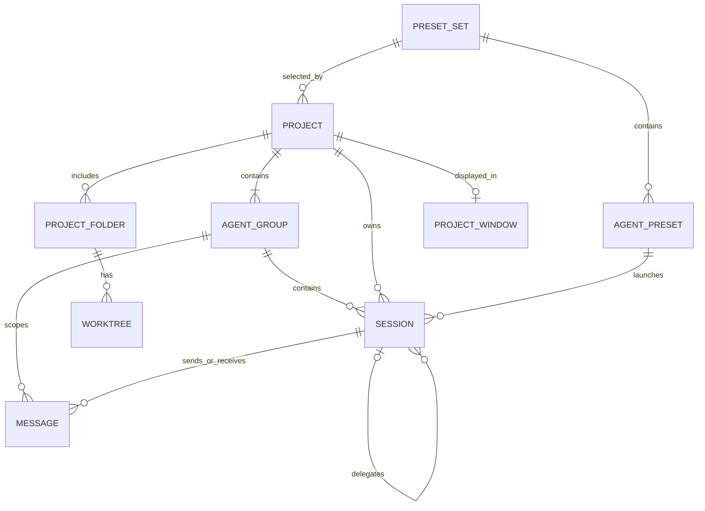
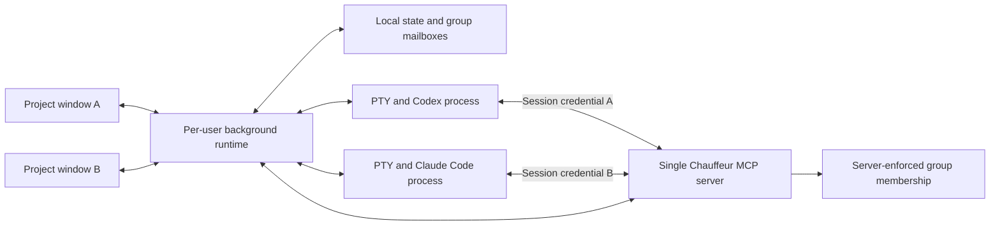

# Chauffeur — MVP product requirements

- Date: 2026-09-15
- Status: Product scope established through the founder interview; implementation choices and validation gates are identified below.
- Platform: macOS
- Initial audience: the developer's own daily use
- Companions: [Project overview](overview.md), [Implementation plan](mvp-implementation-plan.md)

## 1. Problem and outcome

A developer works across personal and client projects, each containing several repositories and requiring different Codex or Claude Code configurations. The current workflow cannot select a configuration directory per agent preset and puts all projects into one window. This makes it difficult to keep the correct profile attached to each task and organize projects across macOS desktops.

Chauffeur must let the developer choose a project, launch agents with its presets, organize work in independent windows, and coordinate those agents while retaining their real terminal interfaces.

The defining scenario is four simultaneously open project windows: Client 1 / Project 1, Client 1 / Project 2, Personal / Project 1, and Client 2 / Project 1. Each can occupy a different Space. The Client 1 projects reuse a preset set while retaining separate work and communication. Quitting and reopening Chauffeur reconnects to the same running sessions.

## 2. Decisions from the interview

| Area | Decision |
| --- | --- |
| Interaction | Embed real interactive Codex and Claude Code terminals. |
| Windows | Independent project windows suitable for different macOS Spaces. |
| Project composition | Group repositories selected under a folder, or start empty and add folders from anywhere. |
| Presets | Projects reference a shared preset set; edits affect future launches. |
| Configuration directories | Reference existing directories only. No directory creation or sign-in management. |
| Git | Manage worktrees for individual repositories; also support existing-folder sessions. |
| Repository access | A session has one primary working directory and can access other repositories in its project. |
| Coordination | Messaging within an agent group and explicit delegation to visible sessions. |
| Communication interface | One Chauffeur-managed MCP server serving multiple isolated agent groups. |
| Agent groups | Several named groups per project; delegated sessions inherit their parent's group. |
| Process lifetime | Agents continue after window close and UI app quit; reopening reconnects. |
| Release audience | Personal use first. |

Detailed defaults below are product proposals derived from those decisions, rather than additional interview answers. Implementation validation must preserve the outcomes above; any required scope change should be documented as a decision.

## 3. Goals and MVP boundary

### Goals

- Select the intended personal/client CLI configuration for every launch without changing global shell configuration.
- Organize projects across independent windows and Spaces.
- Run and revisit multiple terminal sessions without losing work when the UI closes.
- Create isolated repository checkouts for parallel tasks.
- Let Codex and Claude Code exchange context and delegate tasks through a shared project interface.
- Make agent identity, location, activity, and requests for user attention visible.

### Included

Project and preset management; existing-folder registration and discovery; native project windows; terminal tabs and a two-pane split; launch, interrupt, stop, reconnect, and supported conversation resume; managed worktree creation/listing/removal; attention indicators; one MCP server with isolated agent groups, durable mailboxes, explicit delegation, and a supporting skill; local persistence and diagnostics.

### Deferred

Public distribution, automatic updates, CLI installation/upgrades, configuration-directory creation, account sign-in UI, team sharing, cloud sync, remote agents, additional operating systems, a custom chat renderer, a full editor, a diff/merge or PR interface, embedded browser, scheduled automation, autonomous team planning, and atomic worktree creation across multiple repositories.

CLI-provided tools, approvals, and integrations remain available inside each terminal. Chauffeur does not need to reproduce their interfaces.

## 4. Information model

| Record | Required information |
| --- | --- |
| Preset set | Stable ID, name, presets, default preset, revision. |
| Agent preset | Stable ID, name, CLI kind, executable selection, existing configuration-directory path, optional launch arguments, integration state. |
| Project | Stable ID, name, preset-set reference, optional discovery-folder path, folder references, timestamps. |
| Agent group | Stable ID, project ID, name, default/archive state, timestamps. Membership is recorded on sessions and enforced by the MCP server. |
| Project folder | Stable ID, display name, selected and canonical paths, availability, Git repository identity when applicable. |
| Worktree | Stable ID, project/repository reference, canonical path, branch/base commit, ownership, availability. |
| Session | Stable ID, project/group IDs, title, preset launch snapshot, primary folder/worktree, additional paths, runtime attachment, native conversation ID when available, lifecycle/activity state, optional parent/delegation ID. |
| Message | Stable ID, project/group IDs, sender/recipient session IDs, body, timestamps, delivery state, optional reply/delegation reference. |
| Window state | Project ID, frame/display information, selected group/session, open tabs, split layout, sidebar state. |

A project is a logical collection. Its discovery folder is a convenience for choosing folders and does not constrain future membership. Registering a folder never moves or clones it. Non-Git folders can host terminal sessions; worktree actions require a supported Git repository.

Preset sets are referenced, not copied, when selected for projects. Copying preset metadata does not copy configuration directories or credentials; independent CLI state requires selecting different existing directories.

An agent group is a communication team, independent of preset selection and checkout choice. For example, a **Billing fix** group and a **Search refactor** group may coexist in Client 1 / Project 1, use the same Codex/Claude presets, and receive separate mailboxes from the same MCP server. Multiple groups may intentionally touch the same repositories; MCP isolation does not create file isolation.

## 5. Functional requirements

### F1. Project creation and folder management

1. Create, rename, open, and archive a project. Creation requires a name and a preset set; an empty set may be saved but cannot launch agents.
2. Offer **Choose parent folder** and **Start empty**. Folder discovery lists candidate repositories for explicit selection, recognizes Git worktrees with a `.git` file, supports cancellation, and reports unreadable locations. It must avoid symlink loops and traversing Git internals.
3. Add folders from any location after creation. Canonicalize paths to detect duplicate registrations within a project. The same repository may intentionally belong to multiple projects.
4. Show missing or inaccessible folders with a relink action. Preserve associated session history and worktree records.
5. Removing a project/folder registration preserves on-disk repositories and worktrees. Active session references remain resolvable; archiving does not terminate agents.
6. Changing a project's preset set affects new sessions. Running sessions retain their original preset labels and configuration path.
7. Create a Default agent group with each project. Let the user create, rename, select, and archive additional named groups. Archiving hides a group from normal launch choices while preserving its existing sessions/messages and a way to reopen it.
8. User-created sessions select a group, defaulting to the current group's view or Default. A session's group remains fixed for its lifetime and supported resume; moving conversation history between groups is deferred. Delegated sessions inherit their parent's group.

**Acceptance:** Create two projects sharing Client 1 and one using Personal; select two discovered repositories for one project and add an unrelated folder later. Reopening preserves all memberships. Registering the same canonical path twice in one project produces one entry.

### F2. Agent presets and configuration selection

1. Create and edit named preset sets and their Codex/Claude Code presets. Each preset selects an existing configuration directory and a discovered or explicitly selected executable. Default choices minimize repeated launch setup.
2. Launch Codex with that preset's `CODEX_HOME`; launch Claude Code with its `CLAUDE_CONFIG_DIR`. These are child-process values. App-global environment mutation must never determine a concurrent launch's profile.
3. Validate the executable and required directory access before launch. Missing paths, invalid arguments, or unsupported configuration produce actionable errors. Never silently fall back to the CLI's default configuration directory.
4. Preserve native model, tool, and permission settings. Optional launch overrides are explicit argument values, not an evaluated shell command. Managed working-directory and configuration-directory fields cannot be overridden by conflicting freeform arguments.
5. Show the preset and effective configuration path before launch and in session details. A name such as “Client 1” describes the selected preset; it is not evidence that the CLI authenticated as a particular account.
6. Record a launch snapshot of Chauffeur-owned metadata. Preset edits affect new sessions without relaunching existing ones. Conversation resume retains the original configuration-directory reference. External edits to native configuration files continue to follow the CLI's own behavior; the snapshot does not freeze those files.
7. Referenced presets may be archived so old sessions remain understandable. A directory shared by several presets must be identifiable as shared. Chauffeur does not copy, delete, or log its credentials.
8. Use the selected CLI's existing authentication. If authentication needs attention, surface the terminal prompt/error and configuration path. Profile validation must cover credential storage and inherited provider/authentication environment variables; a directory override alone is not an OS security boundary.

Codex documents configuration/state under `CODEX_HOME`, including file-based or keychain credential storage. Claude Code documents `CLAUDE_CONFIG_DIR` for alternate configuration directories and multiple accounts. These establish the launch mechanism; real account separation remains a compatibility test. [Codex configuration](https://learn.chatgpt.com/docs/config-file/config-advanced), [Claude Code environment variables](https://code.claude.com/docs/en/env-vars)

**Acceptance:** Run Personal and Client 1 sessions simultaneously for both CLIs, including different presets in two windows. Verify the effective directory and intended account using supported CLI diagnostics without exposing secrets. An invalid preset path must fail rather than launch another profile. Editing a shared preset changes the next new launch in both linked projects and leaves existing processes attached to their original configuration.

### F3. Independent project windows

1. Provide one main window per open project, with independent navigation and terminal layout. Opening another project creates another window. Opening an already open project focuses its window.
2. Support normal macOS window movement, resizing, full screen, Window menu navigation, and placement on different Spaces. Project selection must not replace another window's contents or move other project windows.
3. Restore available window frame, project, tabs, selection, and split state after relaunch. Use supported macOS restoration; exact Space reassignment after reboot is not an MVP guarantee.
4. Each window contains a project/preset-set header, repository and session sidebar, group filter, terminal area, and project attention list. The user can view all groups or one group. Session context includes agent/preset, group, repository/worktree, and branch. Full names and paths remain available when labels truncate.
5. Offer keyboard commands for new session, open project window, session switching/search, split/unsplit, terminal search, and next session needing attention. Terminal-focused key handling must preserve CLI controls such as interrupt and escape.
6. Closing the window or its terminal tab removes a view. Stopping an agent is a separate, clearly named action. Background sessions remain accessible when no tab is open.

**Acceptance:** Place the four defining project windows on separate Spaces. Start an agent in each, switch between them, and verify independent tabs, selection, and input. Closing one window leaves every process alive. Reopening that project reconnects without starting duplicates or replacing another project window.

### F4. Real terminals and durable session lifetime

1. Run the unmodified interactive CLI in a pseudo-terminal (PTY). Support its full-screen interface, ANSI rendering, resizing, Unicode, keyboard input, selection/copy, bracketed paste, scrollback/search, and clickable links. The app must allow the user to complete native prompts.
2. Session creation selects project, group, preset, primary folder/worktree, and optional initial task. The default is the selected repository and project's last-used valid preset. User-created and delegated sessions share the same launch path.
3. A per-user background service owns PTYs, process groups, and session records independently of the UI. It keeps draining output when no terminal is visible. UI exit, window close, and UI crash must not close the PTY or send termination signals to agents.
4. Reopening attaches to the same live process and restores a coherent terminal screen plus bounded scrollback. Surviving processes without usable terminal restoration do not meet this requirement.
5. **Interrupt** forwards the CLI-appropriate interrupt. **Stop session** ends the selected agent execution and terminal gracefully, with an explicit force-stop fallback. If a CLI uses a shared daemon, stop its specific session without terminating peers. Stopping a parent must not silently stop its delegated sessions; an optional stop-parent-and-children action names its targets.
6. Normal **Quit Chauffeur** exits the UI and keeps sessions running. Provide a separate **Stop all sessions and quit** action. Background-running behavior must be clear in session/window controls and app help.
7. Persist native conversation IDs when a supported mechanism exposes them. Distinguish reattaching a live PTY from resuming a saved conversation in a new process. Never use a global “resume latest” selector that could choose another project or profile.
8. Reboot, logout, or runtime failure ends or interrupts live sessions unless positively reattached by the runtime. Preserve metadata and offer explicit supported resume. Never automatically rerun the original task prompt or claim the original process survived.
9. After sleep/wake, reconcile process and connection state and display authentication/network failures. Background execution applies while macOS is running; the MVP does not promise agent progress while the machine sleeps.
10. Prevent duplicate ownership of a session when multiple windows, reconnect attempts, or app instances reach the service concurrently.

**Acceptance:** With both CLIs running, close all windows, quit the UI, and force-quit only the UI in separate checks. Reopen and verify unchanged runtime identity, intervening output, full-screen rendering, and working input. Stop one session without affecting peers. Simulate service failure and verify an interrupted state and explicit recovery without repeated task execution.

### F5. Repository worktrees and access across repositories

1. For a Git repository, allow **Use existing checkout/worktree** or **Create worktree**. Creation takes a base ref and branch name, displays its destination, and records the resolved base commit.
2. Create one worktree per operation using Git, with collision-safe paths under a Chauffeur-managed location outside the original checkout. Handle branch/path collisions and Git's checked-out-branch restrictions without forceful overrides.
3. Keep worktree creation and agent launch separately recoverable. If creation succeeds but launch fails, retain the worktree and offer a launch retry; do not create another one automatically.
4. List branch, path, repository, availability, and associated sessions. Detect worktrees created, moved, or removed outside the app. Use Git's own worktree inventory for reconciliation. [Git worktree documentation](https://git-scm.com/docs/git-worktree)
5. User-created sessions may explicitly share a checkout. Show existing Chauffeur sessions using that path before joining it. New delegated coding work defaults to a new worktree; sharing a checkout must be an explicit delegation choice.
6. A session may access additional project repositories through CLI-supported directory access. Show the exact primary and additional paths at launch. When the primary repository uses a worktree, do not also add that repository's main checkout implicitly.
7. Additional repositories use their selected existing paths unless individual worktrees are explicitly created for them. Clearly expose this so work in a primary worktree is not mistaken for isolation of the whole project.
8. Offer removal only for app-managed worktrees with no attached live sessions and no modified or untracked files. Show the path and branch in the explicit removal action. Preserve branches; no implicit branch deletion, pruning, or forced cleanup. External worktrees can be unregistered without deletion.

**Acceptance:** Create two worktrees from one repository for parallel sessions and verify independent file changes. From a worktree session, access a second project repository at its displayed path. A failed agent launch leaves the new worktree reusable. Removal refuses dirty, untracked, or active worktrees. Closing a session/window does not remove a worktree.

### F6. Activity and attention

Track process lifecycle separately from agent activity. A live interactive CLI can be waiting at a prompt after finishing a turn.

| State | Meaning / evidence |
| --- | --- |
| Starting | Launch requested; attachment or startup confirmation pending. |
| Running | Confirmed live process; show working/idle detail only when supported events establish it. |
| Needs attention | A supported signal reports input, approval, authentication, or another user action. |
| Turn finished | The agent finished a response; the CLI may remain open for follow-up. |
| Exited | Process ended normally; exit alone does not establish task success. |
| Failed | Launch failure or abnormal process exit with diagnostic context. |
| Interrupted | Runtime continuity was lost or execution was stopped; recovery may be available. |
| Activity unknown | Process is live but fine-grained activity cannot be established reliably. |

Use CLI lifecycle hooks or other documented integration signals for semantic status; terminal silence and output volume are not proof of completion or blocked input. Both CLIs expose lifecycle hooks, but their coverage and behavior must be verified for the supported versions. [Codex hooks](https://learn.chatgpt.com/docs/hooks), [Claude Code hooks](https://code.claude.com/docs/en/hooks)

Surface pending input, failed sessions, and unread completed turns in the project's attention list. Use readable labels as well as color. Optional macOS notifications identify the project and session and open its window when selected. Background notification routing must be validated with the UI closed. Degraded status detection must leave terminals usable and show its limitation.

**Acceptance:** Exercise a response completion, native approval/input prompt, startup error, normal exit, and unavailable hook integration. Verify correct labels without equating process liveness with active work or lack of output with completion. Selecting an attention item opens the right session and project window.

### F7. Agent communication and explicit delegation

#### One MCP server, isolated group communication

Run one Chauffeur-managed Model Context Protocol (MCP) server per macOS user, shared by all supported CLI instances. Chauffeur owns group membership, message persistence, routing, and delegated launches. Each agent is an MCP client of this server. Creating another group must not require a separate MCP server or configuration directory.

Use a local Streamable HTTP endpoint as the proposed transport. MCP defines this transport for an independent server handling multiple client connections; Codex and Claude Code both document HTTP MCP connections. Verify the exact client configuration and authentication behavior during the foundation prototype. [MCP transport specification](https://modelcontextprotocol.io/specification/2025-11-25/basic/transports), [Codex MCP](https://learn.chatgpt.com/docs/extend/mcp?surface=cli), [Claude Code MCP](https://code.claude.com/docs/en/mcp)

At launch, issue session-specific connection credentials associated with the recorded project and group. Authenticate each connection/request and resolve membership in Chauffeur. An agent-supplied group ID, environment label, or MCP transport session ID is not authorization. Missing, invalid, or revoked credentials must fail without access to a default group.

Apply the group boundary to discovery, message recipients, inboxes, results, delegation targets, resources, subscriptions, and notifications. An agent must not enumerate or operate on another group's records, including by supplying guessed IDs. Shared preset sets, config directories, repositories, or branches do not merge groups. The user's Chauffeur UI can inspect all of their groups; an agent connection cannot inherit that application-wide access.

Keep the endpoint local, enforce request authentication and applicable origin checks, and avoid exposing group credentials in transcripts, logs, or checked-in files. This is an MCP routing and data boundary, not filesystem sandboxing against other processes running as the same macOS user. Connection credentials remain valid across UI quit and reconnect; stopping/removing a session revokes its grant. Supported conversation resume re-establishes its recorded membership with a new grant.

The required MCP tool capabilities are:

| Capability | Expected behavior |
| --- | --- |
| Discover | Return the caller's group context, allowed project repository paths, and same-group peer sessions with status and work location. |
| Message | Send text and explicit context references to a session in the caller's group; return a durable message ID. |
| Inbox / reply | Read the caller's queued messages, optionally wait for a bounded interval, acknowledge receipt, and reply with sender attribution. |
| Delegate | Start a session in the caller's group with a task, preset from the project's set, target folder/worktree choice, and parent reference. |
| Status / result | Inspect a same-group delegation and report its outcome back to the parent. |

Exact tool names and schemas belong in the implementation design. Tool calls carry stable IDs for messages and launch retries, and return structured success/error results.

#### Preset integration and supporting skill

Expose the same named Chauffeur MCP server through each preset's CLI adapter. Resolve endpoint and session credentials at process launch. Concurrent sessions using the same preset directory must connect with their own membership without rewriting a shared “current project/group” value. Preserve other configured MCP servers and native permissions.

Prefer supported launch-scoped configuration. Where installation is necessary, manage only namespaced Chauffeur files/entries, preserve existing content, and support removal. Preflight verifies server reachability, authenticated group context, and tool availability. An unavailable integration is visible; it does not silently reroute to another group.

Provide a versioned **Chauffeur** skill that explains the MCP tools and when to discover peers, read messages, delegate a task, and report results. The skill contains generic guidance, with current group context obtained through the server. It is not the communication transport or authorization mechanism. Do not overwrite repository instructions or assume both CLIs discover skills in the same directory.

Codex documents repository `.agents/skills` and user `$HOME/.agents/skills` discovery; Claude Code documents personal, project, and plugin skill locations. Setting a configuration directory is not sufficient proof of preset-scoped skill discovery. The exact loading route is an implementation validation, while MCP tool descriptions must remain sufficient for basic use without the optional guidance skill. [Codex skills](https://learn.chatgpt.com/docs/build-skills), [Claude Code skills](https://code.claude.com/docs/en/skills)

#### Delivery semantics

1. Persist messages before acknowledging acceptance. Distinguish **queued**, **received by integration**, **acknowledged by agent**, and **failed/cancelled**; storage in a mailbox does not prove the recipient read it.
2. Deliver through MCP inbox reads/bounded waits or a verified CLI integration boundary. Busy recipients retain queued messages. Never blindly paste and press Return into an arbitrary terminal prompt, approval dialog, or partially typed user input.
3. MCP connectivity or a server notification alone does not establish that an idle CLI will start another turn. The prototype must verify any automatic wake path. Otherwise retain the message, expose pending attention, and let the user explicitly prompt the recipient to read its inbox. The skill teaches an agent awaiting delegated work to use the bounded inbox wait tool.
4. Retry transport delivery using stable IDs; prevent duplicate mailbox entries and duplicate delegated launches. Do not promise exactly-once agent interpretation or side effects.
5. If the recipient exited, preserve its inbox and report that state. Resume is explicit. Cancellation of queued work is visible to the sender.
6. Show messages and delegation relationships in project/group session details. Keep sender identity, source group, referenced paths, and delivery state visible. Share summaries/paths supplied by the sender; do not automatically copy an entire private conversation.

#### Delegation behavior

Delegation creates a first-class session in the parent's project and group, with its own terminal, selected preset, primary directory, initial task, and MCP connection credentials. It must appear in the project immediately, even if the window is closed. The child can use a different supported CLI. Closing the UI does not suspend the shared MCP server, messaging, or child launch.

Support explicit, single-level delegation in the MVP: a user-created session can launch children; children can message and report back but cannot recursively spawn further sessions through Chauffeur. Proposed default: at most four live delegated children per parent, configurable locally. Reaching the limit returns a clear result without launching another process. These bounds keep the MVP's delegation behavior observable and avoid introducing an autonomous orchestrator.

Task results and process exit are separate. A child can report a result and remain available for follow-up. Parent termination does not delete child work or messages. An unavailable preset, inaccessible directory, or failed launch produces a visible failed delegation record.

**Acceptance:** Connect both CLIs and multiple groups to the same MCP endpoint. Have Codex delegate a specific task to Claude Code and test the reverse direction. Verify the child uses the chosen configuration, inherits the correct group, works in the requested checkout, and returns an attributable result. Repeat with the parent busy and the UI closed. Verify queued messages survive UI restart, retries do not duplicate launches, and another group using the same preset directory cannot discover, read, message, subscribe to, or launch into these sessions, including with guessed record IDs. Invalid/revoked credentials must fail. No case may fall back to a default group.

## 6. Persistence and operational requirements

- Store project/preset/group metadata, memberships, runtime identities, layout, worktree records, and communication history in local application storage. A transactional store should protect message acceptance and launch/delegation bookkeeping across reconnects.
- Persist bounded terminal screen/scrollback state separately from native CLI conversations. The implementation must choose and document retention limits, disk budgets, and cleanup behavior before daily use. Pruning scrollback must not delete native conversations or queued messages.
- Keep rendering and repository discovery off the UI's critical path. Hidden terminals must not cause unbounded output queues or block their agents when buffers rotate.
- Credential files remain in CLI-managed storage. Diagnostics include executable/version, configuration path, working directory, runtime state, and errors without dumping credentials, authentication environment values, or full configuration files.
- Detect and report a stopped/unavailable background service. Once runtime continuity is lost, reconcile actual live process ownership before allowing resume or relaunch.
- Support paths with spaces and Unicode, removable/unavailable folders, display changes, and normal sleep/wake.
- CLI compatibility is versioned. Record tested versions and detect missing capabilities. Terminal launch remains usable where feasible, with unsupported coordination/status visibly disabled.

## 7. Proposed architecture and validation gates

The product contract requires native project windows, real terminals, background process ownership, and one MCP server maintaining isolated groups. Specific UI framework, terminal library, service registration, database, and UI/runtime IPC remain implementation decisions. A SwiftUI/AppKit shell with a mature terminal component and a per-user runtime hosting a local Streamable HTTP MCP endpoint is the candidate architecture.

The runtime and its MCP endpoint must remain alive independently of UI connections. Do not choose a UI-owned subprocess or a service whose idle policy terminates active PTYs. The MCP component may share the runtime process; the diagram shows responsibilities rather than requiring separate processes. Any use of provider-native background agents must still meet the same cross-provider attachment and configuration requirements.

Complete these small prototypes before committing to the full implementation:

| Gate | Evidence required |
| --- | --- |
| V1: Terminal continuity | Both interactive CLIs render/input correctly, survive UI quit/crash, and reattach with current screen, resize behavior, and bounded history. |
| V2: Configuration selection | Two existing directories per CLI run concurrently with the intended settings/accounts; inherited environment and credential storage do not silently select another profile. |
| V3: MCP integration and status | Both CLIs connect to the single server with session-specific membership while sharing preset directories; existing MCP configuration remains usable. Verify optional skill loading and supported lifecycle signals. |
| V4: Groups and message delivery | Demonstrate isolation between two groups in one project and groups in different projects, busy/idle recipients, native approval prompts, unsent terminal input, acknowledgement, and cross-provider delegation without blind terminal submission. |
| V5: macOS lifetime | Project windows occupy independent Spaces; the service remains operational with no UI, and reopening/notifications reach the correct project. |

If a gate fails, record the incompatibility and proposed resolution before implementing dependent features. Basic terminal support must not be presented as satisfying unproven communication or restoration requirements.

Documentation and local CLI help were inspected on 2026-09-15. Installed CLI versions observed were Codex `0.154.0` and Claude Code `2.1.272`; these are investigation baselines, not a tested support matrix. No terminal integration, authentication isolation, or background-runtime prototype has been implemented as part of this PRD.

## 8. Delivery stages

| Stage | Deliverable | Exit condition |
| --- | --- | --- |
| 0. Validate foundations | V1–V5 prototypes and short implementation decisions. | Evidence establishes the required CLI, terminal, configuration, service, and communication paths. |
| 1. Projects and profiles | Local records, existing-directory presets, folder registration, independent project windows, basic terminal launch. | Four project windows use the intended shared/separate presets. |
| 2. Durable daily workflow | Background runtime, terminal restoration, tabs/split, attention state, worktrees. | Quit/reopen and worktree acceptance scenarios pass for both CLIs. |
| 3. Coordination | Single MCP server, group management, per-session connections, durable messages, visible delegation/results, and supporting skill. | Cross-provider delegation works while the UI is closed; group isolation and retries pass. |
| 4. Personal-use release | Locally runnable app, setup/recovery notes, compatibility record, retention settings, daily-use validation. | End-to-end checklist below passes on the development Mac. |

These stages establish dependencies and outcomes; dates and effort estimates follow the foundation prototypes.

## 9. MVP release acceptance

The release must satisfy all F1–F7 acceptance scenarios and the following end-to-end checks:

1. Configure Personal, Client 1, and Client 2 using existing directories, with both Codex and Claude Code represented.
2. Open the four defining projects in four independently placed windows, with at least two projects sharing a preset set.
3. Run at least ten concurrent interactive sessions across those projects. Record hardware, macOS, and CLI versions. Proposed responsiveness targets: p95 warm session switching under 250 ms and reconnection to an existing project within two seconds, excluding provider network response time.
4. Create two groups in one project using the same preset directories and shared MCP endpoint. Complete a task in a new repository worktree, access a second registered repository at its visible path, and delegate a bounded task to the other CLI. Verify the child joins the right group and MCP operations cannot cross group boundaries.
5. Verify needs-attention and result visibility, then close every project window and quit the UI while work continues.
6. Reopen and verify the same live processes, usable restored terminals, correct configuration references, queued/delivered message state, and no duplicated task launches.
7. Verify missing configuration folders, invalid executables, unavailable repositories, dirty worktrees, and failed child launches produce recoverable errors without destructive cleanup or profile fallback.
8. Verify service-failure recovery distinguishes interrupted sessions from live attachments and never silently replays an original task.
9. Use the app for three normal workdays with no observed profile mix-up, duplicate launch, lost accepted message, or session termination caused by closing/quitting the UI. Record failures and resolve them before declaring the MVP ready for daily use.

The numeric limits and responsiveness targets are proposed acceptance targets, not measured performance. Public-release requirements and broader hardware/CLI coverage belong to a later PRD.
